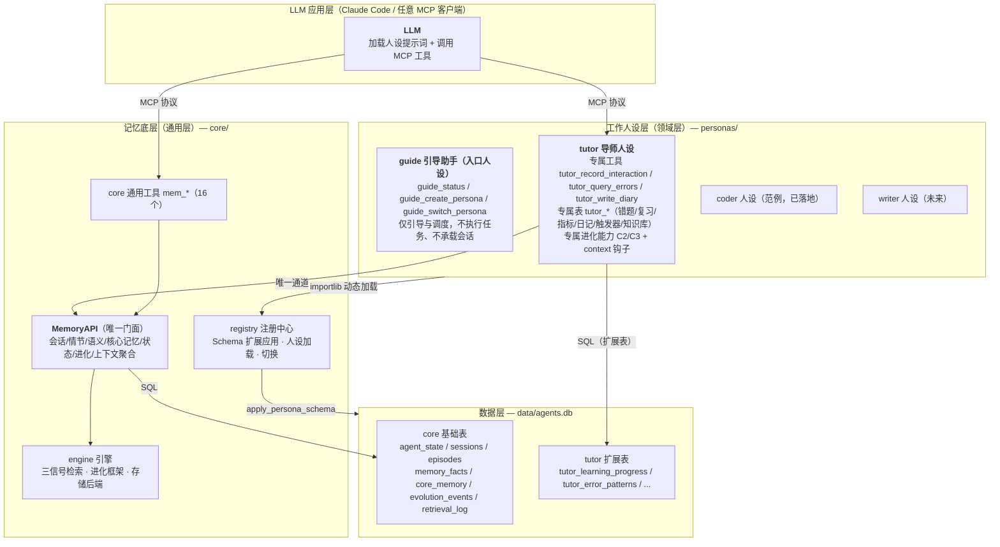
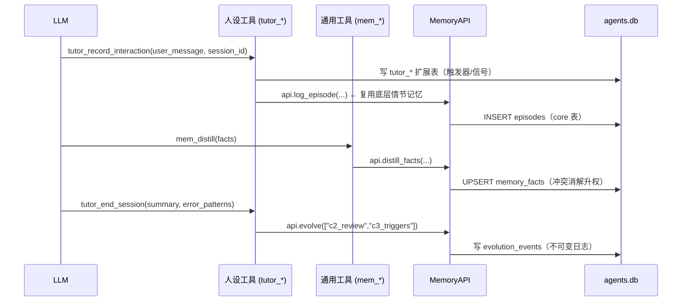
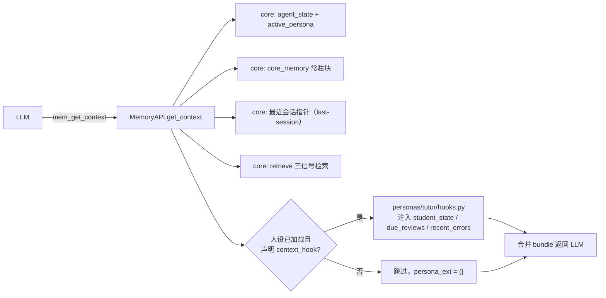
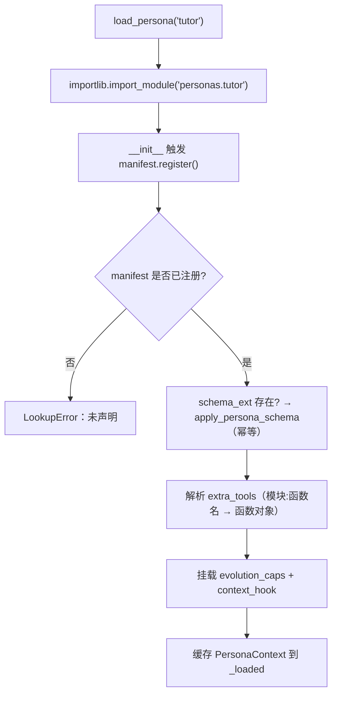
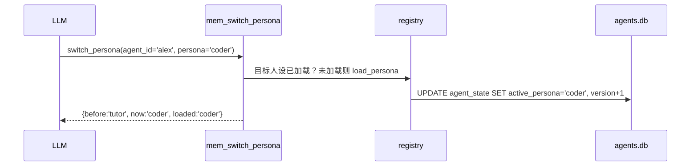

# my_agents · 分层架构设计（记忆底层 × 工作人设层）

> **定位**：把 AI导师系统 v4.0（单一人设的成熟工程）重构为**多工作人设可插拔底座**。  
> 记忆能力下沉为领域无关的**记忆底层**，每个**工作人设**独立维护自己的工具集、数据扩展与提示词。  
> 状态：v1.0 骨架已可运行（`python cli.py smoke` 全链路通过）。

---

## 1. 架构总览



**核心思想一句话**：记忆底层是「会记事的底座」，人设层是「怎么干活的行当」——行当可以换，底座不塌。

---

## 2. 各层职责边界

### 2.1 记忆底层（通用层）· `core/`

| 维度       | 职责                                                                                                                                                                    | 红线                                                 |
| -------- | --------------------------------------------------------------------------------------------------------------------------------------------------------------------- | -------------------------------------------------- |
| **记忆能力** | 会话生命周期、情节记忆、语义蒸馏与检索、核心记忆块、通用工作状态、进化事件日志                                                                                                                               | 不出现任何教学/编程/写作领域词汇                                  |
| **通用工具** | `mem_*` 16 个：start_session / log_episode / recall_episodes / distill / get_context / update_state / retrieve / switch_persona / evolve / health / db_query / schema 等 | 全人设共享，工具名不带领域前缀                                    |
| **基础表**  | `agent_state`（泛化状态，乐观锁）/ `sessions` / `episodes` / `memory_facts` / `core_memory` / `evolution_events` / `retrieval_log` + 2 张 FTS5                                   | 无 `tutor_` 等前缀污染                                   |
| **引擎**   | 三信号检索（FTS trigram → 实体 → LIKE）、进化调度框架、存储后端 ABC                                                                                                                        | `core` 绝不 import `personas`（与 v4.0 ENGINE.md 红线一致） |

**记忆底层回答的问题**：谁（agent_id）在什么时候（sessions）说了什么（episodes）→ 沉淀为什么事实（memory_facts）→ 如何被再次想起（retrieve）→ 系统如何自我改进（evolution_events）。

### 2.2 工作人设层（领域层）· `personas/<name>/`

每个工作人设是一个**自包含包**，独立维护四样东西：

| 组件               | 载体                                           | 导师人设示例                                                                                                  |
| ---------------- | -------------------------------------------- | ------------------------------------------------------------------------------------------------------- |
| ① 专属 MCP 工具集     | `tools/`，`<persona>_` 前缀                     | `tutor_record_interaction`（数字信号+触发器）、`tutor_query_errors`、`tutor_write_diary`、`tutor_end_session`（收尾组合） |
| ② 专属数据库扩展字段      | `schema_ext.py`：`EXT_COLUMNS` + `EXT_TABLES` | `agent_state` 追加 `tutor_mood/energy/focus/ds_*` 11 列；新增 6 张 `tutor_*` 表                                 |
| ③ 专属提示词          | `prompts/`                                   | init / persona / methodology / workflow                                                                 |
| ④ 专属进化能力 + 上下文钩子 | `evolution.py` + `hooks.py`                  | C2 复习计划、C3 触发器休眠；get_context 注入学生状态/到期复习/错题预警                                                           |

**人设层回答的问题**：这个「行当」需要哪些工具（做哪些事）、需要记住哪些领域专属数据（额外字段）、用什么人设语气说话（提示词）、如何自我进化（专属能力）。

#### 2.2.1 入口人设 `guide`（仅引导与调度，不干活）

`guide` 是系统管理层的**入口人设**，与 `tutor`/`coder` 的「干活」定位不同：它只负责把新用户引导到正确的人设，自身不做任何实际任务。

| 维度 | 设计取舍 |
| --- | --- |
| 触发时机 | 系统启动时自动加载（`server.py` 默认 `_discover_personas` 含 `guide`）；首轮 `guide_status` 返回 `needs_onboarding` 才走引导 |
| 职责边界 | 引导创建/切换工作人格 + 状态确认 + 需求不明时引导式提问；**不**调用 `start_session`/`log_episode`/`distill`，不承载会话 |
| 极简配置 | 不声明 `context_hook` / `schema_ext` / `evolution`；档案存 `core_memory`（`persona_profile:<name>`），`onboarded` 走 `state_json`——最大化降低 token 消耗 |
| 退出逻辑 | 引导完成（切换成功 + 标记 `onboarded`）即退出；后续工作由目标人设接管，互不干预 |
| 工具集 | `guide_status`（判定是否需要引导）/ `guide_create_persona`（收集 name/purpose/tone/domain 建档 + 关键词推荐）/ `guide_switch_persona`（切换 + 标记 onboarded + 状态确认） |

交互流程：

```
系统启动 → 加载 guide（入口）
   ├─ guide_status(agent_id)
   │     ├─ already_onboarded → 直接按 active_persona 工作（引导结束）
   │     └─ needs_onboarding  → 进入引导
   ├─ 引导式提问收集 4 参数（name / purpose / tone ∈ {严谨,轻松,鼓励型} / domain）
   ├─ guide_create_persona(...) → 存 core_memory + 关键词推荐已部署人格
   └─ guide_switch_persona(persona) → 切换 + onboarded=True + 状态确认 → 退出引导
```

### 2.3 依赖方向（不可违反）

```
personas/<name>  ──import──▶  core.api.MemoryAPI + core.manifest
      │                             ▲
      │ 声明式注册                    │ 只消费契约，不反向依赖
      ▼                             │
core.manifest.PersonaManifest  ◀────┘
      │
      ▼
core.registry  ──▶  core.db / core.schema
```

- **core 不认识任何 persona**：registry 只消费 `PersonaManifest` 契约，通过 importlib 动态加载。
- **persona 只经 MemoryAPI 触碰数据**：人设工具拿到的 `api` 是底层门面；领域扩展表由 registry 应用后，人设直接 `api.conn` 读写（见 §5 权衡）。

---

## 3. 数据流转方式

### 3.1 写路径（LLM → 记忆）



**规则**：

- 领域专属数据 → 人设工具直接写自己的扩展表；
- 通用记忆（对话回合/事实/会话）→ 一律经 `MemoryAPI`，保证一致性与检索索引同步（FTS 触发器）。

### 3.2 读路径（记忆 → LLM 上下文聚合）



**关键设计**：人设钩子**只做加法**（往 `persona_ext` 里塞领域字段），不修改 core 已产出的内容——底层对「上层注入了什么」零感知。

### 3.3 进化路径

```
人设端触发（如 tutor_end_session）
  └→ api.evolve(capabilities=["c2_review","c3_triggers"], persona="tutor")
       ├→ registry 取已加载人设的 evolution_caps（未注册能力 → not_registered）
       ├→ 逐个 cap.run(conn, agent_id, dry_run)      ← 人设自定义逻辑
       │     └→ 每次变更 INSERT evolution_events     ← core 不可变日志统一收口
       └→ 返回 {persona, dry_run, results}
```

统一收口的意义：`evolution_events` 是**全人设共享的审计日志**，`revert_evolution` 天然支持跨人设回滚（`event_type` 带 `tutor_` 前缀区分来源）。

---

## 4. 接口定义（记忆底层 ↔ 工作人设层）

### 4.1 人设清单契约 · `core/manifest.py`

```python
@dataclass(frozen=True)
class PersonaManifest:
    name: str                    # 唯一标识：tutor / coder / writer ...
    display_name: str
    version: str
    description: str
    entry: str                   # 人设包路径：personas.tutor
    tools: list[str]             # 专属工具引用："模块:函数名"
    core_tools_used: list[str]   # 声明依赖的 core 工具（可读性/校验）
    schema_ext: str | None       # 专属 Schema 扩展模块
    prompts: dict[str, str]      # {role: 提示词文件路径}
    evolution: str | None        # 专属进化能力模块（导出 CAPABILITIES）
    context_hook: str | None     # get_context 扩展钩子："模块:函数名"
    default_agent_id: str
```

每个新人设 = 一个 `manifest.py` + `import 即注册`（`__init__.py` 里 `from . import manifest`）。

### 4.2 底层门面 · `core/api.py`（人设层唯一可依赖的类）

```python
class MemoryAPI:
    # 会话生命周期
    start_session(agent_id, persona, subject="", topic="") -> dict      # 幂等复用
    end_session(session_id, summary="", turn_count=0) -> dict
    # 情节记忆
    log_episode(session_id, role, content, agent_id="", topic="") -> dict
    recall_episodes(session_id="", agent_id="", last_n=1, scope=...) -> dict
    # 语义记忆
    distill_facts(agent_id, facts: list[dict], persona="") -> dict       # upsert 冲突消解
    retrieve(query, agent_id, persona="", scope="all", limit=10) -> list[RetrievalHit]
    # 核心记忆
    get_core_blocks(agent_id) -> dict
    set_core_block(agent_id, block_key, block_value, priority=5) -> dict
    # 工作状态（PATCH + 乐观锁，扩展列自动路由）
    get_state(agent_id) -> dict
    update_state(agent_id, updates: dict, expected_version=None) -> dict
    # 进化
    evolve(capabilities=None, dry_run=False, agent_id="", persona="") -> dict
    revert_evolution(event_id, agent_id="") -> dict
    # 上下文聚合（读路径唯一出口）
    get_context(agent_id, persona="", freshness_level="hot",
                focus_subject="", session_id="", limit=8) -> dict
    # 运维
    health() -> dict
```

**约定**：所有方法返回 dict（JSON 直出 MCP）；`agent_id`/`persona` 是通用维度，不是领域字段。

### 4.3 Schema 扩展契约 · `personas/<name>/schema_ext.py`

```python
# 扩展列（对 core 表追加，前缀 <persona>_ 防冲突）
EXT_COLUMNS: list[ExtColumn] = [
    ExtColumn(table="agent_state", name="tutor_mood", ddl="TEXT NOT NULL DEFAULT 'neutral'"),
    ...
]
# 扩展表（表名必须带 <persona>_ 前缀，registry 守卫校验）
EXT_TABLES = """
CREATE TABLE IF NOT EXISTS tutor_learning_progress (...);
...
"""
```

`registry.apply_persona_schema` 幂等应用：扩展列走 `PRAGMA table_info` 查重后 `ALTER TABLE`；扩展表 `CREATE IF NOT EXISTS`；**前缀守卫**防止人设污染通用层。

### 4.4 工具注册契约

- **core 工具**：`mem_` 前缀，定义于 `core/tools/__init__.py::CORE_TOOLS`，全人设共享。
- **人设工具**：`<persona>_` 前缀，函数签名统一 `fn(api: MemoryAPI, params: dict) -> dict`，由 `server.py` 包装注册到 FastMCP。

### 4.5 进化能力契约 · `personas/<name>/evolution.py`

```python
CAPABILITIES: dict[str, EvolutionCapability] = {
    "c2_review": EvolutionCapability(key="c2_review", description="...",
                                     run=lambda conn, agent_id="", dry_run=False: {...}),
}
```

### 4.6 上下文钩子契约 · `personas/<name>/hooks.py`

```python
def inject_tutor_context(bundle: dict, agent_id: str, freshness_level: str) -> dict:
    # 返回 dict 合并进 bundle["persona_ext"]；只做加法，不改 core 产物
```

---

## 5. 人设动态加载与切换机制

### 5.1 加载链路（`registry.load_persona`）



### 5.2 切换语义（`registry.switch_persona` / `mem_switch_persona`）



**三条隔离原则（切换的根基）**：

| 隔离维度 | 机制                                    | 效果               |
| ---- | ------------------------------------- | ---------------- |
| 数据隔离 | 全部表带 `agent_id`；扩展表带 `tutor_` 前缀      | 切换不销毁任何历史，可随时切回  |
| 工具隔离 | core `mem_*` 恒可见；人设工具 `<persona>_` 前缀 | 工具名永不冲突，多人设工具可共存 |
| 会话隔离 | `sessions.persona` 字段记录归属             | 跨人设回溯会话不串台       |

**三种部署形态**：

1. **单进程多人设**（默认）：一个 MCP server 加载多个人设，`mem_switch_persona` 热切换 active 指针。适合个人使用。
2. **单进程单人设**：`--personas tutor`，仅暴露所需工具集，面更小。
3. **多进程多实例**：每 MCP 配置连不同 server（如导师服务 + 编程服务并行），隔离最强。

> 实现说明：FastMCP 支持运行时 `add_tool`，因此"加载即注册"无技术障碍；动态**移除**工具受限，故切换采用"全注册 + active 指针路由"策略，工具可见性通过提示词与 server 启动参数控制。

---

## 6. Schema 扩展机制（字段如何"按需组合"）

```
core/schema.py（只建 7 张基础表）
        │
        ▼
registry.apply_persona_schema(tutor.schema_ext)
        │
        ├─ EXT_COLUMNS ──▶ ALTER TABLE agent_state ADD COLUMN tutor_mood TEXT ...
        │                    （PRAGMA 查重，幂等）
        └─ EXT_TABLES ───▶ CREATE TABLE IF NOT EXISTS tutor_learning_progress (...)
                             （前缀守卫：表名必须含 tutor_）
```

- **扩展列适用**：同一实体（agent_state）上叠加领域状态（mood/energy/ds\_*），避免 JOIN。
- **扩展表适用**：领域实体（错题/复习计划/日记），粒度更大、可独立索引。
- **冲突控制**：前缀 + UNIQUE(agent_id, ...) + 守卫校验，多人设共存零冲突。

---

## 7. 从 AI导师系统 v4.0 的迁移路线

| v4.0 资产                                                                                                                                                                          | 迁移去向                                        | 说明                                      |
| -------------------------------------------------------------------------------------------------------------------------------------------------------------------------------- | ------------------------------------------- | --------------------------------------- |
| `tutor_mcp/engine/`（retrieval/evolution/models/storage）                                                                                                                          | `core/engine/`                              | 本就领域无关，平移 + 委托 MemoryAPI 最小实现（完整版直接搬）   |
| `sessions / episodes / memory_facts / core_memory / evolution_events / retrieval_log`                                                                                            | `core/schema.py`                            | 通用，原样保留（补 `persona` 列、`agent_state` 泛化） |
| `student_state` 教学列（mood/energy/ds\_*）                                                                                                                                           | `personas/tutor/schema_ext.py::EXT_COLUMNS` | 挂到泛化 `agent_state` 上                    |
| `learning_progress / teaching_metrics / error_patterns / pitfall_triggers / teacher_knowledge / diary_entries`                                                                   | `personas/tutor/schema_ext.py::EXT_TABLES`  | 表名加 `tutor_` 前缀                         |
| `start_session / log_episode / recall_episodes / distill_memory / get_context / update_state / run_evolution / revert_evolution / health_check / db_query / db_execute / schema` | `core/tools/`（改名 `mem_*`）                   | 语义不变，命名空间化                              |
| `record_interaction / query_errors / write_diary / end_session`                                                                                                                  | `personas/tutor/tools/`（`tutor_*`）          | 教学专属，随人设打包                              |
| `system/*.md` 提示词                                                                                                                                                                | `personas/tutor/prompts/`                   | 工具名替换为新命名空间                             |
| `migrations/0001→0006`                                                                                                                                                           | `core/migrations/`                          | 保留序贯迁移框架                                |

**数据迁移**：旧 `tutor.db` 数据可通过 `ATTACH` + `INSERT INTO ... SELECT` 导入（core 表去重、tutor 表加前缀），或双库并行过渡。

---

## 8. 验证方式

```bash
pip install mcp[cli]           # 仅 MCP 服务需要
python cli.py init             # 初始化库 + 应用全部人设 Schema 扩展
python cli.py personas         # 列出已加载人设
python cli.py switch alex tutor
python cli.py context alex tutor   # 预览聚合上下文（验证钩子注入）
python cli.py smoke            # 端到端冒烟：会话→情节→蒸馏→检索→切换→进化→健康
python server.py --personas tutor  # 启动 MCP 服务
```

**红线自检**（沿用 v4.0 ENGINE.md）：

```bash
# core 不反向依赖 personas
grep -rn "personas" core/ || echo "core 纯净 ✅"
# 扩展表前缀守卫
grep -rn "CREATE TABLE" personas/*/schema_ext.py | grep -v "CREATE TABLE IF NOT EXISTS \(tutor\|coder\|writer\)_" && echo "前缀违规" || echo "前缀合规 ✅"
```

---

## 9. 目录结构（最终形态）

```
D:\my_agents\
├── README.md               ← 项目入口
├── ARCHITECTURE.md         ← 本文件（设计 SSOT）
├── server.py               ← 统一 MCP 入口（组装 core + personas）
├── cli.py                  ← 人设管理 CLI（init/personas/switch/context/smoke）
├── core/                   ← ★记忆底层（通用层）
│   ├── api.py              ←   MemoryAPI 唯一门面（接口定义核心）
│   ├── schema.py           ←   7 张基础表 + 2 FTS（单一来源）
│   ├── db.py               ←   连接单例（WAL + Row，AGENTS_DB_PATH 可覆盖）
│   ├── manifest.py         ←   PersonaManifest 契约 + 注册表
│   ├── registry.py         ←   加载/切换/Schema 扩展应用（核心机制）
│   ├── tools/              ←   mem_* 16 个通用工具
│   └── engine/             ←   检索/进化/存储（v4.0 平移）
├── personas/               ← ★工作人设层（领域层）
│   ├── tutor/              ←   AI导师人设（迁移自 v4.0）
│   │   ├── manifest.py     ←     声明式注册
│   │   ├── schema_ext.py   ←     11 扩展列 + 6 扩展表
│   │   ├── tools/          ←     tutor_record_interaction 等 4 工具
│   │   ├── evolution.py    ←     C2/C3 专属进化能力
│   │   ├── hooks.py        ←     get_context 注入钩子
│   │   └── prompts/        ←     提示词（从 system/ 迁移）
│   └── (coder/ writer/ ... ←     新人设即新目录 + manifest.py)
├── data/agents.db          ← 运行时生成（gitignore）
└── diary/                  ← 日记落盘（按 agent 隔离）
```

